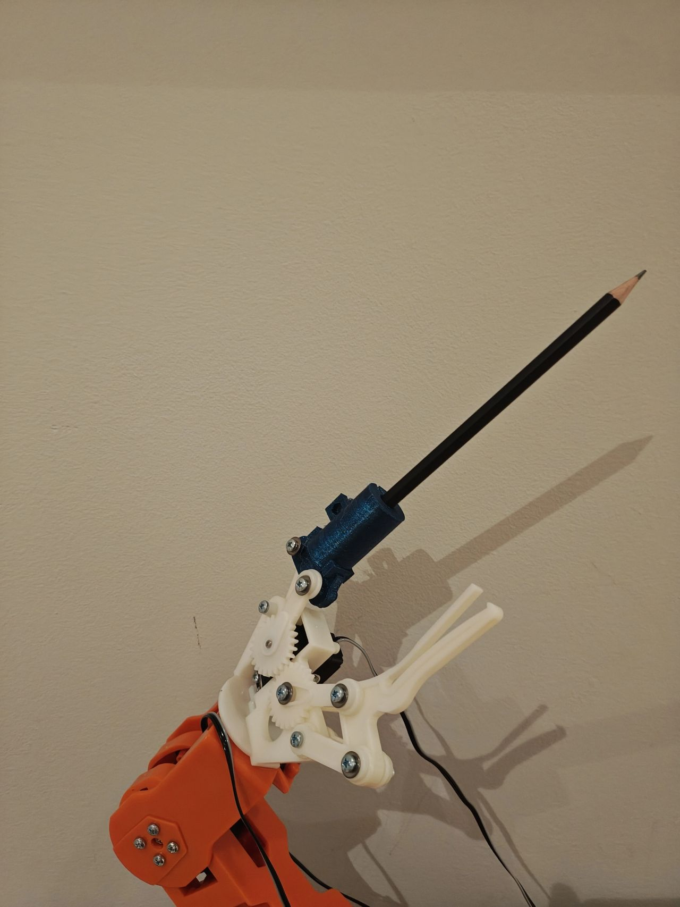
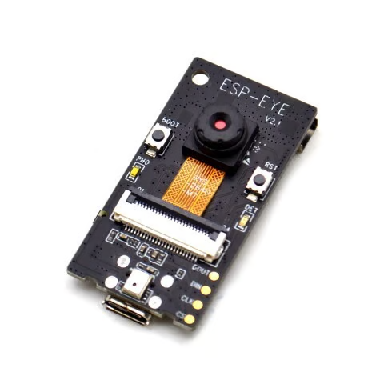
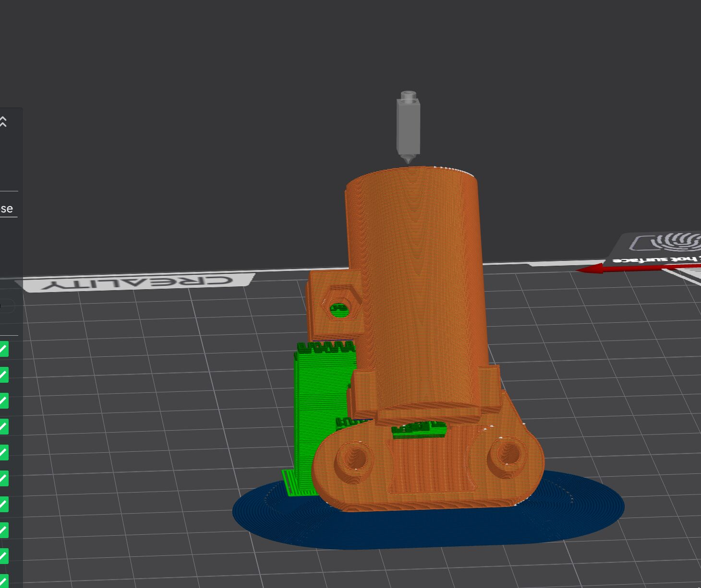
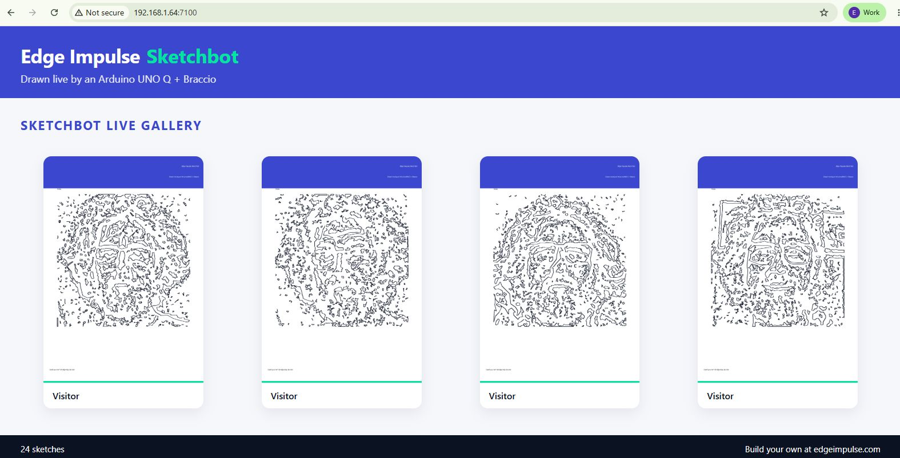
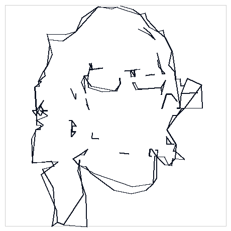

# Edge Impulse Sketchbot (UNO Q + Braccio)

A live "sketchbot" demo: a **TinkerKit Braccio** arm driven by an **Arduino
UNO Q** takes a photo of a visitor, turns it into a line-art caricature, and
**draws it with a real pencil** on an Edge Impulse–branded postcard. Finished
sketches appear on a branded **live web gallery**, exactly like a trade-show
Sketchbot wall.

<p align="center">
  <br>
  <em>The real demo hardware — a TinkerKit Braccio drawing through the 3D-printed pencil grip.</em>
</p>


```
 Wrist camera @ person pose ──► portrait ──► vectorize ──► plan strokes ──► IK ──► Braccio pencil
                                                                            │
 Wrist camera @ page pose   ──► paper calibration / monitoring ◄────────────┘
                                                                            │
                                        branded PNG ──► live web gallery ◄───┘
```

> Inspired by the classic caricature "Sketchbot" installations, rebuilt on
> low-cost Arduino hardware with Edge Impulse branding.

## What it does

1. **Capture** – aim the **wrist-mounted camera** at the visitor (the arm moves
   to a "person" pose) and grab a frame.
2. **Portrait → caricature line art** – detect the face, **segment the person**
   (GrabCut) so the hair/head outline is drawn and a busy background dropped,
   then trace the silhouette + interior features (glasses, eyes, beard) into
   clean single-stroke line art. Optionally use an Edge Impulse model to gate
   capture (e.g. "person present" / "smile").
3. **Vectorize** – turn the line art into ordered pen strokes.
4. **Plan** – scale strokes into the paper workspace, order them to minimise
   pen travel, and insert pen-up / pen-down moves.
5. **Draw** – stream joint commands to the Braccio over the arm agent
   (`127.0.0.1:8765`), using inverse kinematics to place the pencil tip.
6. **Calibrate** – aim the **same wrist camera** at the paper (a "page" pose) to
   find the paper corners (homography) so drawings land on the branded box.
7. **Gallery** – composite the finished sketch onto the Edge Impulse postcard
   template and publish it to the **live web gallery** page.

## Hardware

| Role   | Device                                                 | USB ID        |
| ------ | ------------------------------------------------------ | ------------- |
| Camera | **One** wrist camera — a USB webcam, or an **ESP-EYE** over Wi-Fi/USB (`firmware/esp_eye_camera/`) | set in config |
| Arm    | Arduino UNO Q + TinkerKit Braccio                      | —             |
| Pen    | 3D-printed drawing grip (see `hardware/pencil-grip/`)  | —             |

**One camera does both jobs**: the arm points the wrist camera at the visitor to
capture, then at the paper to calibrate (poses in `config/workspace.yaml`
`camera_poses`). A fixed two-camera rig (face + gripper) is still supported — see
`config/cameras.yaml`. Cameras are resolved by **USB vendor:product ID** (stable
across reboots); find yours with `python -m sketch_artist.cameras`.

**No USB webcam?** Flash an **ESP-EYE** (ESP32 camera) with the firmware in
[`firmware/esp_eye_camera/`](firmware/esp_eye_camera/) and point the `single`
camera at it over Wi-Fi (`url:`) or USB (`serial:`) in `config/cameras.yaml`.

<p align="center">
  
</p>

The pencil is held by a printed part that clamps the tool with an M3 screw.
Print `hardware/pencil-grip/braccio_pen_finger_8mm.stl` to keep the claws
working alongside the pen, or `braccio_pencil_grip_8mm.stl` for the more rigid
finger-replacement collar (`_10mm` for pens/markers). There is a matching
`braccio_camera_finger.stl` and a small `braccio_wrist_camera_mount.stl`. See
[hardware/pencil-grip/README.md](hardware/pencil-grip/README.md).

After fitting one, set `links.wrist_pen_mm` in `config/workspace.yaml` and run
`python scripts/check_workspace.py --suggest`: the pen length decides how big
the drawable area is, and the planner silently skips moves it cannot solve.

<p align="center">
  <br>
  <em>Printing the pencil grip (sliced in Creality Print).</em>
</p>

## Prerequisites

- An UNO Q running the Braccio **arm-control agent** on `127.0.0.1:8765`.
  Deploy it from this repo — [`app_lab/braccio_remote_agent`](app_lab/braccio_remote_agent/)
  (Arduino App Lab; uses the **`RoboServo`** library, which builds on the UNO Q's
  Zephyr core — classic `Servo`/`Braccio` don't):
  ```bash
  cp -r app_lab/braccio_remote_agent ~/ArduinoApps/
  arduino-app-cli app start ~/ArduinoApps/braccio_remote_agent   # -> listening on 8765
  ```
  > **No hardware?** Skip this and use the built-in **software simulator** or
  > **Gazebo** instead — see [Simulation](#simulation-no-hardware) below. Both
  > speak the same `M`/`S` protocol, so nothing else changes.
- Docker on the UNO Q (arm64), or Python 3.11+ with the `requirements.txt`
  installed. (OpenCV is pinned to **4.x** — 5.x dropped the bundled Haar
  cascades the face detector needs.)
- A camera is optional for a first run (use `--image`). For live capture, plug
  in the wrist USB camera and set its VID:PID in `config/cameras.yaml`; list
  nodes with:

  ```bash
  python -m sketch_artist.cameras
  ```

## Quick start (dry run, no arm)

Prove the pipeline end-to-end without moving the arm — it reads a photo,
produces the toolpath preview, and writes a branded gallery card.

The Arduino UNO Q (Debian) ships an *externally managed* Python (PEP 668) and
only provides `python3`, so install into a virtualenv (the `setup` helper does
this for you):

```bash
# One-time: Debian splits venv/pip into separate packages
sudo apt update && sudo apt install -y python3-venv python3-pip

./scripts/run_demo.sh setup        # creates .venv and installs requirements
./scripts/run_demo.sh dry          # dry-run from examples/sample_face_eoin.png
xdg-open output/preview.png        # toolpath the arm would draw
xdg-open output/gallery/*.png      # branded postcard
```

If `setup` reports the `ensurepip` / `python3-venv` error, run the `apt install`
line above (it prints the exact command for your Python version) and re-run
`setup`.

Equivalently, by hand:

```bash
python3 -m venv .venv
.venv/bin/pip install -r requirements.txt
.venv/bin/python -m sketch_artist.cli --image examples/sample_face_eoin.png --dry-run
```

> Don't run `pip install -r requirements.txt` against the system Python — it
> fails with `externally-managed-environment`. Use the venv above, or skip
> Python setup entirely with Docker (`docker compose up -d --build`).

## Run the full demo

```bash
# 1. Start the arm agent on the UNO Q (braccio_remote_agent) -> :8765
# 2. Print assets/edge_impulse_paper_template.svg and tape it in the paper box
# 3. Calibrate the paper with the wrist camera (arm at the page pose):
.venv/bin/python -m sketch_artist.calibration --save config/homography.json
# 4. Run: capture a visitor, draw them, publish to the gallery:
.venv/bin/python -m sketch_artist.cli
```

Start the branded live gallery on its own (port `7100`):

```bash
./scripts/run_demo.sh gallery       # http://<uno-q>:7100
```

<p align="center">
  <br>
  <em>The branded live gallery — finished sketches appear here in real time.</em>
</p>

Or bring the whole thing up with Docker (cameras + arm reach + gallery):

```bash
docker compose up -d --build
docker compose logs -f sketchbot
```

## Simulation (no hardware)

You can run the **entire** capture → plan → draw loop with no arm. The
simulator is a drop-in for the real UNO Q agent: it speaks the same `M`/`S`
protocol, runs **forward kinematics** on every servo command to track the pen
tip, and renders exactly what the arm would have drawn. Because it inverts the
same IK the real arm uses, a faithful sim drawing means the geometry, IK,
planner and stroke ordering are all correct.

### 1. Software simulator (fast, dependency-free — great for CI)

```bash
# Draw the sample end-to-end on the built-in simulator, no arm needed:
./scripts/run_demo.sh sim --style none
xdg-open output/sim_drawing.png     # what the simulated pen actually drew
```

The portrait step segments the person, so the pen draws the hair/head outline
and glasses as a clean caricature — here is the sample drawn on the simulator:



Equivalently, drive it exactly like the real arm over TCP:

```bash
./scripts/run_demo.sh agent                       # M/S sim agent on :8765
# ...then in another shell, the normal pipeline (no --sim flag):
.venv/bin/python -m sketch_artist.cli --image examples/sample_face_eoin.png \
    --style cyclist --host 127.0.0.1 --port 8770
```

With Docker: `docker compose up -d sim` starts the agent on `:8765`, then
`docker compose run --rm sketchbot python -m sketch_artist.cli --image \
examples/sample_face_eoin.png --style engineer` draws against it.

### 2. Gazebo (full 3D physics view, real Braccio model)

The sketchbot drives the **real mesh Braccio** from the companion
[`unoq-braccio`](https://github.com/edgeimpulse/unoq-braccio) repo
(`unoq_braccio_sim`). The bridge in [`sim/gazebo/`](sim/gazebo/) speaks the same
`M`/`S` protocol and republishes moves to that model's controller, so nothing in
the pipeline changes:

```bash
scripts/run_gazebo_e2e.sh                            # build, draw, and check it
```

That builds the ROS workspace, starts Gazebo headless, streams every planned
move over `M`/`S`, records the simulated pen tip off TF, and compares what the
arm drew with what was planned. `--gui` watches it happen.

The simulated arm carries the **same printed part you bolt to the real Braccio**
(`hardware/pencil-grip/braccio_pen_finger_8mm.stl`, loaded straight from
`hardware/`), and the pen's path is painted onto the paper as gz markers while it
draws, so the picture appears under the pencil in the 3D view. This is the pen
tip measured off TF during a real Gazebo run — the drawing, not a re-simulation:


Pick a different printed variant with `grip_mesh:=`, and remember to match the
bore: `grip_mesh:=braccio_pen_finger_10mm.stl pen_diameter:=0.010`. Turn the live
ink off with `ink:=false`. To drive it by hand:

```bash
ros2 launch braccio_sim sketchbot_gazebo.launch.py   # Gazebo + Braccio + bridge :8765
.venv/bin/python -m sketch_artist.cli --image examples/sample_face_eoin.png --style none
```

See [sim/gazebo/README.md](sim/gazebo/README.md) for the build/run steps. No ROS
box handy? Render the **same** model + meshes headlessly with the sketchbot
driving it (needs the `unoq-braccio` meshes; the render derives from GPL-3.0
meshes, so generate it locally rather than committing it):

```bash
.venv/bin/pip install trimesh matplotlib scipy
.venv/bin/python -m sim.render_arm --out output/gazebo_caricature.png
```

## Testing

```bash
.venv/bin/pip install -r requirements-dev.txt   # adds pytest
./scripts/run_demo.sh test                       # or: .venv/bin/python -m pytest
```

The suite covers config/geometry sanity (including a guard that the whole paper
is reachable), the IK ↔ FK round trip, the planner, vectorizer, scenes,
preview/gallery, the `M`/`S` protocol over a real socket, a full end-to-end
pipeline run against the simulator, and the printable STLs in `hardware/`
(closed, manifold, single-shell, and consistent with `workspace.yaml`).

## Configuration

| File                    | Purpose                                                        |
| ----------------------- | ------------------------------------------------------------- |
| `config/cameras.yaml`   | Camera source(s): USB webcam `usb_id`, or ESP-EYE `url`/`serial` |
| `config/workspace.yaml` | Braccio link lengths, paper placement, pen up/down heights    |
| `config/drawing.yaml`   | Edge/contour parameters, stroke simplification, stroke cap    |
| `config/branding.yaml`  | Edge Impulse colours, tagline, logo/QR paths, paper layout    |

## Calibration & safety

Drawing is only as good as the geometry. Measure your arm's link lengths and
paper placement and put them in `config/workspace.yaml`. See
[docs/calibration.md](docs/calibration.md) for the homography step and
[docs/safety.md](docs/safety.md) before letting the arm move near people.

> ⚠️ The inverse-kinematics servo mapping in `sketch_artist/kinematics.py` uses
> configurable offsets that **must be tuned to your servos' zero positions**.
> Start with `--dry-run`, then `--slow`, and keep the e-stop within reach.

The Braccio is a serial arm, so the shoulder servo is an absolute elevation
while the elbow and wrist servos measure the bend *relative* to the previous
link (90° = in line). The IK follows that, and two limits fall out of it: the
elbow and wrist only bend ±90°, so the shoulder-to-wrist distance has to stay
between `hypot(l1, l2)` and `l1 + l2`, and the forearm can never point above
horizontal while the pen stays vertical. The drawable region is therefore an
annulus, not a disc — `scripts/check_workspace.py` shows it and sizes the paper
box for you.

## How it maps to Edge Impulse

- **Branding** – the postcard template and web gallery use the Edge Impulse
  palette and tagline (`config/branding.yaml`). Drop the official logo at
  `assets/edge_impulse_logo.png` and a QR at `assets/qr.png`.
- **Optional model gate** – wire an Edge Impulse image model (person / smile /
  pose) to decide *when* to capture, reusing the `edgeimpulse_ros` or
  `edge_impulse_linux` runner from the `unoq-braccio` project.

## Repository layout

```text
sketch_artist/     Vision + planning + kinematics + FK + sim + arm client
web/               Branded live gallery web server + static assets
app_lab/           Arduino App Lab arm-control agent (deploy to the UNO Q)
firmware/          ESP-EYE camera firmware (Wi-Fi/USB image source)
config/            Camera, workspace, drawing and branding configuration
assets/            Edge Impulse postcard template + logo/QR slots
hardware/          3D-printable Braccio pencil grip + camera mounts (STL/SCAD)
sim/               Headless arm renderer + Gazebo M/S bridge (real model)
scripts/           Camera listing and demo runner helpers
tests/             pytest suite (pipeline, kinematics, sim, end-to-end)
docs/              Architecture, calibration and safety notes
examples/          A sample face image for dry runs
```

## License

MIT — see [LICENSE](LICENSE).

The 3D-printable files in `hardware/pencil-grip/` are **CC BY-SA 4.0**
(by *eoinedge*, [Thingiverse thing:7382987](https://www.thingiverse.com/thing:7382987));
see [hardware/pencil-grip/LICENSE](hardware/pencil-grip/LICENSE).
