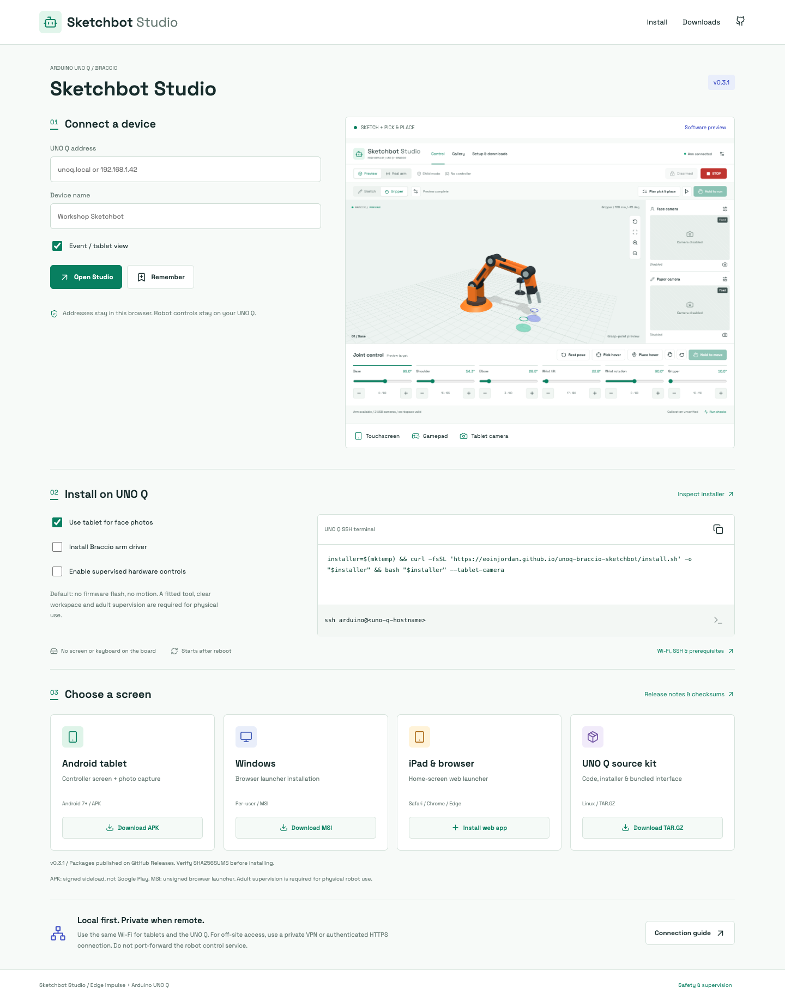
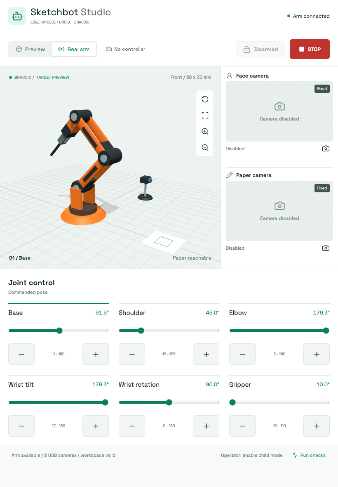

# Install And Connect

**Start here:** <https://eoinjordan.github.io/unoq-braccio-sketchbot/>

The public page generates an installer command, remembers device addresses in
your browser, displays a pairing QR code and links to published packages. Robot
commands and camera images stay on the UNO Q's own server. No public relay or
account is required for a local event.



## Headless UNO Q

1. Connect the UNO Q to your event Wi-Fi using Arduino App Lab or your existing
   network setup. Note its hostname or local IP. This first Wi-Fi/SSH setup is
   not performed by the public webpage.
2. On a laptop, SSH into the board: `ssh arduino@<uno-q-hostname>`. Type the
   password only into the SSH terminal. The board needs no screen or keyboard.
3. Open the setup page, keep **Use tablet for face photos** selected, and copy
   its install command into that SSH session. The default does not flash
   firmware or enable motion.
4. Open the printed device address on a phone/tablet on the same Wi-Fi, or put
   that address into the public launcher and scan its QR code.
5. An adult configures and verifies the physical tool and camera roles in the
   full Studio view. Event view is available at `http://<device>:7100/?event=1`.

The default public command is equivalent to:

```bash
installer=$(mktemp) && \
curl -fsSL 'https://eoinjordan.github.io/unoq-braccio-sketchbot/install.sh' -o "$installer" && \
bash "$installer" --tablet-camera
```

Inspect the downloaded script before running it when installing on a new device.
It clones this repository into `~/unoq-braccio-sketchbot`, creates a virtual
environment without deleting an existing one, installs binary Python wheels,
and installs a persistent user service. It never invokes sudo or changes the
OS image. If Debian venv support is missing, install `python3-venv` and
`python3-pip` as an administrator first. Internet access is needed for Git and
Python package downloads; the source kit is not an offline wheel bundle.

An existing checkout with local changes or a different origin is left alone.
Clean updates are fast-forward only. Ignored `config/runtime.yaml` settings
remain in place. `--tablet-camera` explicitly changes the face source; omit it
to retain your existing camera selection.

| Installer option | Effect |
| --- | --- |
| `--dry-run` | Print the plan without network, file or service changes |
| `--no-start` | Install code/dependencies without service changes |
| `--tablet-camera` | Use tablet/phone photos as the face source |
| `--install-agent --servo-power-off` | Explicitly provision/build/flash a new Braccio agent with servo power disconnected |
| `--allow-motion` | Explicitly enable supervised control capability; sessions still begin disarmed |

Driver provisioning refuses to overwrite an existing `~/ArduinoApps/braccio_remote_agent`.
The servo-power-off flag is an operator confirmation, not an electrical test.
Do not use it while servo power is connected. Firmware starts in its configured
rest pose, so restoring power can cause movement. Physical calibration and the
installed PWM driver's precision still need checking; see [validation](validation.md).

## Tablet At An Event

The tablet is the screen and input device. The UNO Q runs the vision and control
server. In Event view, touch targets are larger and setup/task controls are hidden.
Real movement is unavailable unless the server permits it, child mode is enabled,
and an adult explicitly confirms and arms the session. Plus/minus and paired
gamepad controls remain hold-to-run. The Stop button stays visible.

Event view is a simplified layout, **not authentication or a certified child-safety
system**. Use a trusted/isolated event network, keep an adult at the physical
power cutoff, and keep fingers, hair and clothing out of the sweep. Never let
the public Internet reach port 7100 or the raw arm port 8765.

For full setup, open the device address without `?event=1`. To return to the public
page, use **Setup & downloads** in the full Studio navigation or the Android app
menu. Remembered device addresses are local browser storage; there is no shared
public directory of robots.



## Tablet Camera

The public installer defaults to **This tablet / phone** for the face role.
Alternatively choose it in **Setup > Cameras** for Face or Paper.

- **Take photo** opens the device camera/photo picker, including on local HTTP.
  The browser downsizes it to at most 1280 pixels before uploading to the UNO Q.
- The server accepts JPEG/PNG up to 4 MB and 4096 pixels per side, re-encodes the
  image without source metadata, stores it only in memory and expires it after
  five minutes. **Clear tablet photo** deletes the server copy immediately.
- Photo previews are labelled **Tablet frame**, not live camera video. Do not
  use a still photo as feedback while a robot is moving.
- The live-video button uses `getUserMedia` only after a click, only for video
  (no microphone), and only on HTTPS or localhost. Normal LAN HTTP cannot use
  this browser API; use Take photo or a private HTTPS connection instead.
- Hiding/leaving the page stops local camera tracks. Captures are not uploaded
  to GitHub Pages or a cloud service. The Android system camera may use private
  app cache for the selected image; normal Android cache controls apply.

Use the tablet for portraits and a fixed USB/ESP camera for watching the arm when
possible. Changing or disabling a camera clears its pending tablet frame.

## Downloads

Packages are published at [GitHub Releases](https://github.com/eoinjordan/unoq-braccio-sketchbot/releases).
The public setup page reads that release list and links only to published assets.
Check the release's `SHA256SUMS` before installing.

| Package | What it installs |
| --- | --- |
| `Sketchbot-Tablet-0.3.1.apk` | Android 7+ controller WebView, device address entry, system camera/photo picker and paired-gamepad forwarding |
| `Sketchbot-Launcher-0.3.1.msi` | Windows per-user Start Menu/browser launcher; not a motor driver or a native camera server |
| `Sketchbot-Source-0.3.1.tar.gz` | Source, installer and prebuilt web assets; Python dependencies still download during setup |
| PWA | Public setup/device launcher on Android, iPad, Windows, macOS or Linux; no native installer needed |

The Android APK is release-key signed, but is not distributed through Google Play.
Android may ask you to permit installation from the browser/files app. Do not
disable device security globally. The Windows MSI is **not Authenticode-signed**;
Windows may warn about an unknown publisher. It creates a `.url` shortcut only
and requires no administrator installation.

Android pairs Bluetooth controllers through OS settings, not through the webpage.
The APK forwards native controller input into Studio's existing enable/deadzone
logic, including on LAN HTTP. Controller removal and app backgrounding release
control. Browser/PWA gamepads depend on browser support and secure-context rules.
The APK camera path uses the system photo picker, not background camera streaming.

On iPad, use Safari's Share > Add to Home Screen. On Chrome/Edge, use the browser's
Install app action or the setup page's install button when offered. The PWA caches
the launcher, not robot-control responses or camera images.

## Private Remote Access

The public HTTPS page cannot directly fetch a private HTTP camera or control API
because of browser security restrictions. It opens the device UI as a top-level
page instead. This is intentional; there is no CORS bypass or unauthenticated
public tunnel.

For access away from the event network, an owner can put both devices on a
private VPN, for example Tailscale, and serve the existing local app privately:

```bash
tailscale serve --bg http://127.0.0.1:7100
```

Use the private HTTPS address that command reports in the launcher. Install and
authenticate the VPN using its official instructions; no credentials belong in
the public page or this repository. Do not use a public Funnel or port forwarding
for the unauthenticated robot API. A reverse proxy must preserve the original
Host header, because cross-origin control requests are rejected.

## Release Builds

```bash
npm --prefix web ci
npm --prefix web run build
npm --prefix web run build:site
bash scripts/build_packages.sh
```

Native builds use Java 17, Android SDK platform/build-tools 35, `wixl`, `msiinfo`,
zip and OpenSSL. Set `ANDROID_HOME`, `ANDROID_PLATFORM` or `ANDROID_BUILD_TOOLS`
when the SDK is elsewhere. APK signing material is created outside the repository
in `~/.local/share/sketchbot-release-signing`, or `SKETCHBOT_SIGNING_DIR`. Back up
that directory securely: future APK updates must use the same key. Never commit
or publish the password or private key. Windows publisher signing needs an
appropriate external certificate and is not fabricated by this build.

The Pages workflow publishes only `site/`. The release MSI workflow installs and
uninstalls the published package on an isolated Windows runner. Python installer
tests mock provisioning commands and verify that dirty checkouts, settings and
existing arm agents are preserved. Browser tests use a software arm and synthetic
camera inputs, not the physical robot. See [validation](validation.md).