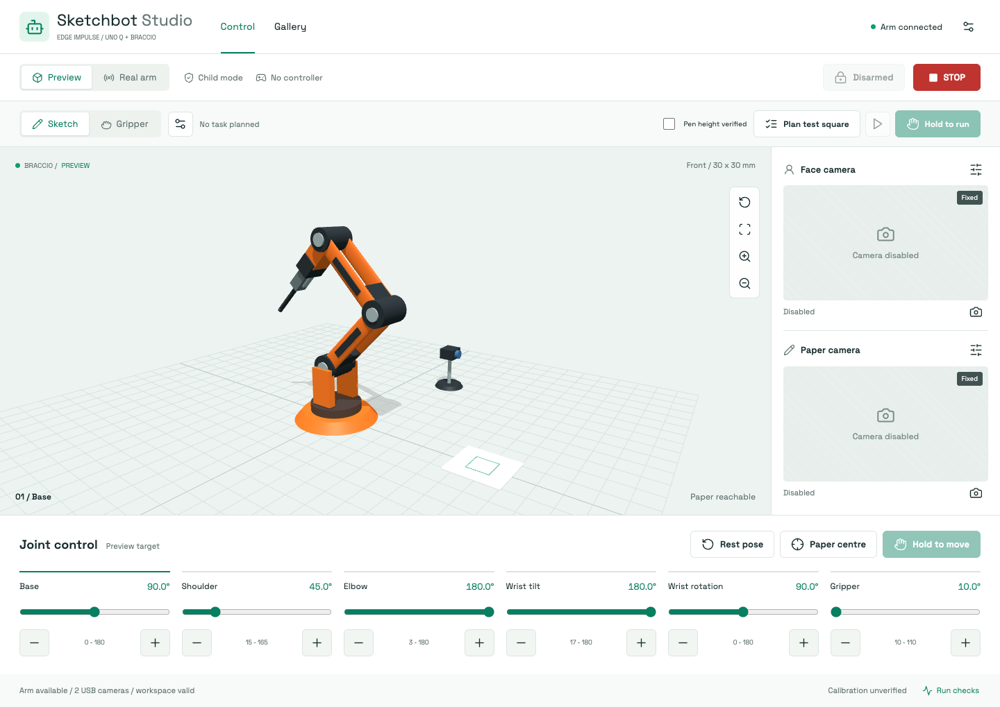
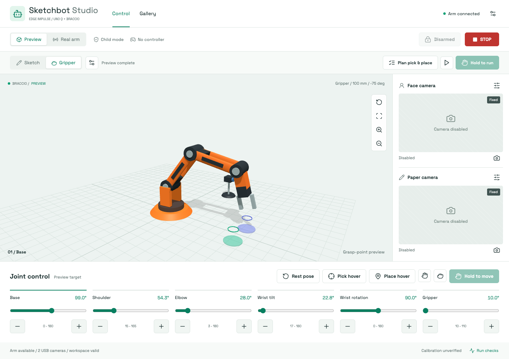
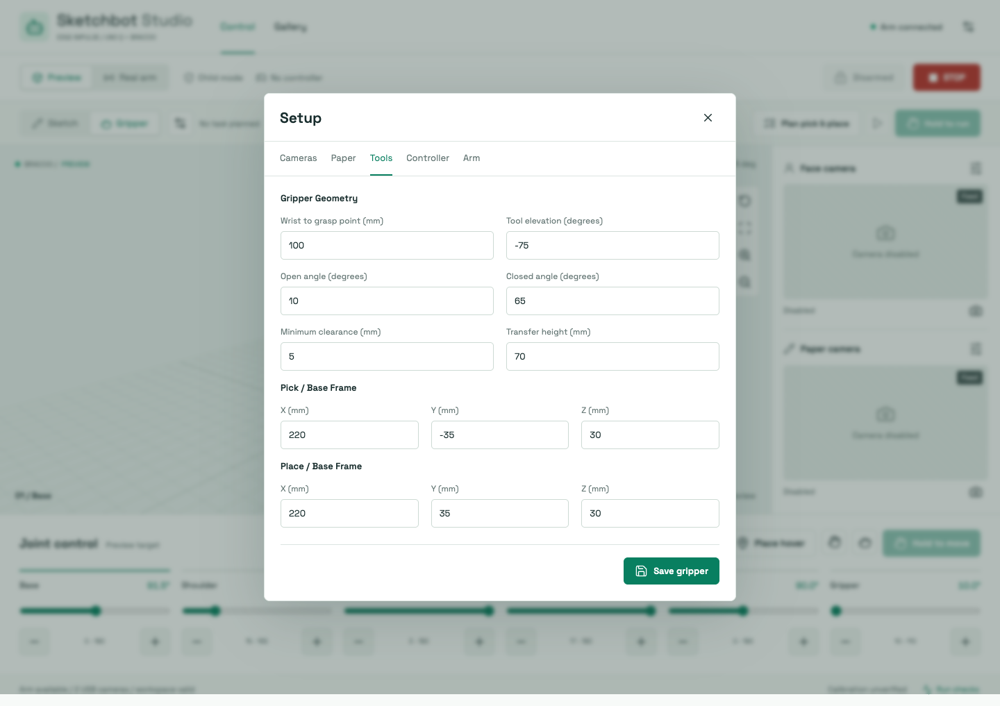
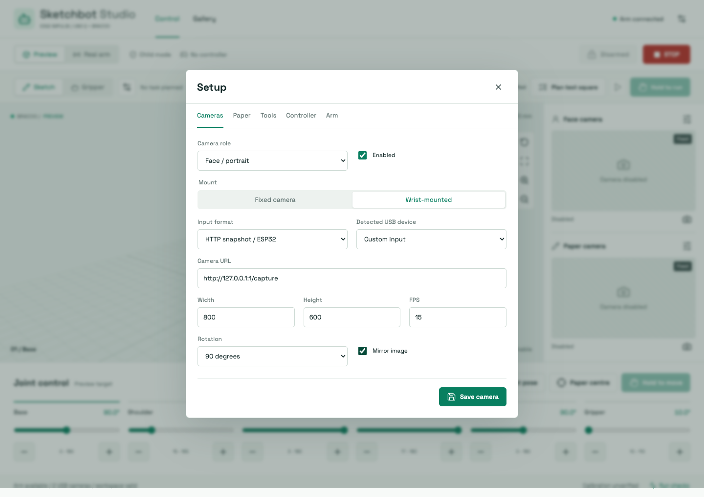
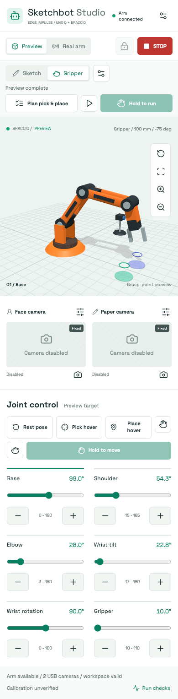

# Sketchbot Studio

The studio is served by `web.server` at `/`; the original gallery is at
`/gallery`. Its Three.js assets, icons and fonts are bundled locally, so the
interface does not need a CDN. The model is a parametric Braccio representation
using the configured link lengths and servo mappings, not a collision simulator.



## Start

```bash
./scripts/run_demo.sh setup
.venv/bin/python -m web.server --bind 127.0.0.1 --port 7100
```

Open `http://localhost:7100`. To read an arm on another machine, add
`--arm-host <hostname> --arm-port 8765`. For a trusted local-network touchscreen,
use `--bind 0.0.0.0`. Do not expose this unauthenticated hardware interface to the
Internet. The adult confirmation is an operating interlock, not an account or PIN.

Hardware motion is disabled unless the server is started with `--allow-motion`.
Every browser starts in **Preview**, with no armed session. A failed arm connection
never substitutes a simulated robot for hardware status. The 3D preview still
works when the arm is offline.

The startup report checks arm status, USB devices, the face detector, network
stream support, ESP serial support and 147 paper/pen-height samples. Camera
frames are probed when previewed or when **Run checks** is selected. A configured
but unprobed camera is not reported as available. Discovery does not move the arm,
rewrite geometry or select an ambiguous camera silently.

## Sketch And Gripper Tools

The **Sketch / Gripper** selector chooses the physical tool profile; the separate
**Preview / Real arm** selector chooses whether controls can send hardware moves.
Switching tool profiles disarms, cancels any task, and never moves the arm. This
is not an automatic mechanical tool changer. Fit the selected tool while power
is safely isolated, then verify its measurements before enabling motion.

Sketch mode uses the existing pen geometry and paper calibration. Gripper mode
uses a separate wrist-to-grasp-point length, tool elevation, open/closed jaw
angles and clearance floor. Shared base/link dimensions, servo mappings and
mechanical limits are retained. Changing gripper settings does not overwrite
the pen profile. Physical portrait CLI runs refuse to start while Gripper mode
is selected; CLI dry runs and simulator runs remain available.



**Setup > Tools** configures the gripper and its pick/place targets in the arm
base frame: X away from the base, Y to its left, Z above the table. Defaults are
nominal preview values, not measurements: 100 mm tool length, -75 degree tool
elevation, 10 degree open / 65 degree closed jaws, 5 mm minimum clearance,
70 mm transfer height, and targets at (220, -35, 30) and (220, 35, 30) mm.
Measure your gripper and objects; never infer grip force from servo angle.



**Pick hover** and **Place hover**, or clicking the coloured target markers,
set a raised preview pose. The hand buttons open/close the gripper in Preview,
or send bounded jaw steps while held in an armed Real arm session. Gripper
arming additionally requires confirmation that the gripper is fitted, the pen
is removed and the tool dimensions are checked.

### Pick And Place

1. Select Gripper and set measured tool dimensions and reachable target poses.
2. Choose **Plan pick & place**. The current pose and every interpolated joint
    path are checked against tool clearance and joint limits. Raise the tool
    first if it is below transfer height.
3. Use **Play task preview** in Preview mode to inspect the sequence without
    changing the real commanded pose.
4. For physical work, select Real arm, plan again, check the workspace, confirm
    the fitted tool and arm. Hold **Hold to run** to advance through approach,
    open, lower, grip, lift, transfer, lower, release and retract.
5. Release to pause. Stop cancels and disarms without opening the jaws or
    attempting an automatic return. An accepted bounded step may still finish.

No force sensor, object detection, grasp success feedback or automatic recovery
is implied. A completed command sequence does not prove that an object was picked
up. Changes to the arm pose outside the task invalidate it before further steps.

### Test Sketch

**Plan test square** prepares a 10 mm square centred in the configured paper
box, with pen-up approach and final lift. The whole route is preflighted; its
preview works in child mode without hardware motion. To actually draw, verify
pen contact under supervision, select Real arm, explicitly disable child mode,
plan again, check **Pen height verified**, arm, then hold **Hold to run**.
The app never automatically disables child mode or treats reachability as proof
of pen contact. This simple test uses the configured contact height without
the portrait CLI's backlash/contact-dip compensation.

The test does not replace the portrait pipeline; run the CLI for full generated
portraits. The web session interlock cannot stop an independent direct TCP client.

## Cameras



In **Setup > Cameras**, select the **Face** or **Paper** role, then its transport.
Mount and transport are independent. A fixed face camera does not trigger the
CLI's wrist-camera aiming poses. Wrist-mounted cameras use the saved `person`
and `page` poses when the drawing CLI aims them. Manual web camera previews never
automatically reposition the arm.

| Input | Configuration | Notes |
| --- | --- | --- |
| HTTP snapshot | `http://<camera>/capture` | ESP32-EYE / ESP32-S3 camera firmware that serves individual images; JPEG or another OpenCV-decodable image |
| MJPEG | `http://<camera>:81/stream` | Use the actual stream port/path provided by the camera firmware |
| RTSP | `rtsp://<camera>/stream` | Requires the installed OpenCV FFmpeg backend |
| USB video | Linux `/dev/videoN`, VID:PID, or macOS device index | Automatic, MJPG, YUYV, UYVY, NV12 and H264 requests; actual support depends on the driver |
| ESP USB serial | `/dev/ttyUSB0`, `/dev/cu.*`, or `auto`, plus baud | Requires the repository's framed JPEG serial protocol and pyserial; arbitrary ESP USB firmware is not interchangeable |

The detected-device menu excludes the UNO Q's Qualcomm encoder/decoder nodes.
On macOS, indices can change after unplugging cameras; select the named device
again when necessary. On Linux prefer VID:PID over a changing `/dev/videoN`.
No ESP firmware is flashed by the studio; a different board revision must use
firmware and camera pin mappings appropriate to that board.

Resolution, frame rate, orientation and mirroring are stored per role. The
orientation transform is shared by previews and portrait capture. Failed camera
frames are hidden, not left on screen labelled live. Face detection is presence
detection only; no identity recognition is performed. The camera must actually
face the visitor, and detector availability is reported separately from whether
a face is present.

### Logi on the Mac, arm on the UNO Q

A camera physically connected to the Mac cannot be opened as a USB device on
the UNO Q. Run a local studio/camera server on the Mac, configure its Paper role
to the detected Logitech device, and forward only its loopback endpoint:

```bash
# Mac camera server, hardware motion disabled:
.venv/bin/python -m web.server --bind 127.0.0.1 --port 7110

# Separate terminal; authenticate directly in the terminal:
ssh -N -R 127.0.0.1:7110:127.0.0.1:7110 \
    -L 17100:127.0.0.1:7100 arduino@echoglow-test-leo
```

On the UNO Q, set the Paper camera to HTTP snapshot,
`http://127.0.0.1:7110/api/camera/gripper.jpg`, and Fixed mounting.
Open `http://localhost:17100` on the Mac for the UNO Q studio. This also supplies
the secure localhost context needed by browsers that restrict the Gamepad API.
The Mac camera server and SSH connection must stay running. If they stop, the
paper preview reports unavailable. Connecting the Logi directly to the UNO Q
instead removes that dependency; choose its Linux VID:PID in the menu.

## Paper Side And Geometry

**Setup > Paper** sets the paper's position, dimensions and rotation about the
arm base. Front is 0 degrees; the left/right presets use +60/-60 degrees to stay
inside the stock arm's base rotation range. Custom angles and rear placement can
be entered, but saving is rejected if any sampled paper point is unreachable.
A rear-facing box normally cannot be reached by the stock servo mapping.

The origin is the near-left corner in the unrotated paper frame. Rotation is
applied to that frame around the base. The planner, calibration, reach checker,
preview, gallery renderer and software simulator share this transform; changing
side does not rotate the portrait in its postcard preview.

**Setup > Arm** sets the measured base height, link lengths, wrist-to-tip length,
pen tilt and pen heights. Advanced workspace JSON exposes servo offsets/signs,
limits, camera poses, planner and motion settings. Invalid/nonfinite values and
unreachable workspaces are rejected. Geometry changes disarm the controls and
mark physical calibration unverified. Reachability is not proof that the paper
is flat, the tool length is measured correctly, or the path is collision-free.

The documented files in `config/` remain the defaults. Menu and legacy
calibration-page changes are atomically persisted to `config/runtime.yaml`,
which is ignored by git. The CLI and studio load the same overlay. Retain that
file when deploying; do not replace an existing installation's settings blindly.

## Touch And Gamepad

Sliders, joint selection on the 3D model and clicks on the paper change only the
preview. **Paper centre** previews a reachable pen-up target. **Rest pose** also
only changes the preview. No large target jump is automatically sent to hardware.

For supervised hardware control, start with `--allow-motion`, select **Real arm**,
confirm a clear workspace and accessible power cutoff, then arm. Hold a joint's
plus/minus button to jog, or hold **Hold to move** to advance toward the preview
in bounded steps. Releasing stops sending further steps; one already accepted
step can finish. The arm agent reports commanded angles, not encoder feedback.

Pair Bluetooth controllers with the computer or tablet's operating system. USB
controllers use the same browser Gamepad API. Use a supported browser on localhost
or HTTPS. The web app does not perform Bluetooth pairing itself.

**Setup > Controller** configures the controller, four axis mappings and inversion,
deadzone, enable/stop/open/close buttons, step size and child mode. Defaults are:

| Control | Default |
| --- | --- |
| Gamepad enabled | Off |
| Joint axes | Base 0, shoulder 1, elbow 3, wrist tilt 2 |
| Axis inversion | Shoulder and elbow |
| Deadzone | 0.22 |
| Held enable | Button index 4, usually left bumper |
| Stop/disarm | Button index 1, usually B / Circle |
| Gripper open / close | Button indices 6 / 7, usually the triggers; enable must be held |
| Maximum step in child mode | 0.75 degrees |

Controller layouts vary; verify the mappings in Preview. A newly connected
controller must return to neutral with enable released before it can move.
Gamepad disconnect, page blur/hiding, Escape and Stop disarm the session.
Inactive sessions expire after 15 seconds. Settings saves also disarm.

Child mode additionally rejects a step whose modelled tool clearance would drop
below 5 mm. It is for supervised exploration, not physical pen-contact work.
It is not a certified child-safety system. Keep hair, fingers and loose clothing
out of reach. **Software Stop holds position; it does not remove servo power.**
Other direct TCP clients, boot-drawing services and the legacy calibration UI
are outside the studio's session interlock. Do not operate them concurrently.

### When Controls Do Not Move

- Sliders change a preview target, including when armed. Hold **Hold to move**
    to advance toward it, or hold a joint's plus/minus button for direct jogging.
- The server must have `--allow-motion`, Real arm must be selected, and the
    session must still be armed. It expires after 15 seconds without movement.
- Keep the browser focused and visible. Switching applications, hiding the
    page, releasing enable or pressing Stop interrupts control. In an embedded
    browser that reports itself hidden, open the localhost URL in a normal browser;
    do not bypass the visibility guard.
- Child mode cannot lower a pen to the paper. A task requiring contact stays
    disabled until supervised mode and the contact confirmation are selected.
- Temporary, explicitly unqueued busy/rate-limit responses do not disarm the
    browser. Status reads are serialized without being mistaken for another
    movement; two concurrent movement requests still cannot queue behind each other.
- Delayed status replies from before an arming change cannot cancel the new
    session. Connection failures, rejected hardware commands and expired sessions
    still stop control.



## Tests And Functional Checks

```bash
.venv/bin/python -m pip install -r requirements-dev.txt
.venv/bin/python -m pytest

npm --prefix web install
npm --prefix web test
npm --prefix web run build
npm --prefix web exec -- playwright install chromium
npm --prefix web run test:browser

# Read-only hardware checks; no motion or settings writes:
.venv/bin/python scripts/check_hardware.py --probe-cameras
.venv/bin/python scripts/check_hardware.py --arm-host <uno-q> --require-arm
.venv/bin/python scripts/check_hardware.py --probe-cameras --require-face
```

`--require-arm` and `--require-face` make absent required devices fail the check.
Optional absent hardware is reported without preventing preview-only use.
`--config-dir` can point the hardware harness at a separate configuration set.

Python tests cover camera dispatch/orientation, fixed-camera no-motion behavior,
paper transforms, rendering invariance, atomic persistence, numeric validation,
arming/timeout/stop races, bounded commands, a TCP arm simulator and HTTP APIs.
They also complete both pick/place and test-square tasks in software, check tool
profile preservation, validate contact confirmation and test status-poll contention.
Node tests cover gamepad deadzones, enable/stop priority, reconnect gating,
mapping, joint bounds, gripper button gating and Three.js coordinate transforms.
Playwright starts its own temporary-config server and
software arm on port 7119; it never connects to the physical robot. It checks
desktop/mobile layout, nonblank WebGL pixels, model animation, settings saves,
paper rejection, touch control, synthetic gamepad input, busy/stale-status recovery,
tool switching, gripper tasks and gallery navigation. Screenshots and
failure traces are placed in `output/`.

Set `SKETCHBOT_PYTHON` for browser tests when the Python environment is not
`.venv/bin/python`. Real controller pairing, mechanical clearances and pen
contact still need supervised checks on the assembled rig.

The checked-in screenshots come from this isolated simulator, with cameras
disabled and any example gallery card labelled **Simulation preview**. They
contain no live webcam footage. See [validation status](validation.md).