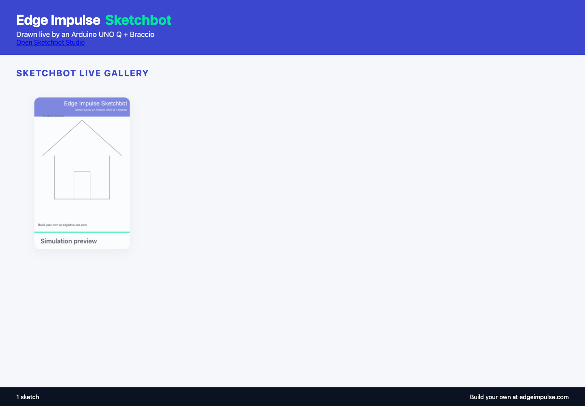

# Validation Status

## Software

The release gate is the complete Python suite, Node input/model unit tests and
the Playwright functional suite. Browser tests start an isolated software arm
and temporary settings; they do not connect to the real robot.

Local validation on 2026-09-19: **171 Python tests**, **16 JavaScript unit tests**
and **19 Playwright tests**. Python ran in the project's macOS virtual environment;
the CI matrix below additionally covers Python 3.11 and 3.13 on Linux.

```bash
.venv/bin/python -m pytest -o addopts='' -q
npm --prefix web test
npm --prefix web run build
npm --prefix web run test:browser
```

Coverage includes fixed-camera no-motion behavior, camera transports and
orientation, paper-side transforms, rendered output, atomic settings, joint
limits, arming/stop races, status contention, stale browser state, gripper
geometry, complete pick/place and test-square sequences, tool confirmation,
touch controls, gamepad inputs, 3D pixels/animation and gallery navigation.

The [CI workflow](../.github/workflows/test.yml) repeats the Python checks on
3.11 and 3.13, and the web checks on Node 22. A local pass is not a claim that a
GitHub Actions run has already completed.

## Hardware Observed On 2026-09-19

- SSH and the UNO Q arm agent are reachable; six commanded joint targets can
  be read. These are targets, not measured encoder feedback.
- ESP32 snapshot frames were verified at 800 x 600. Face detection is installed;
  the observed frame did not contain a detected face.
- Logitech StreamCam frames were verified at 1280 x 720 through the Mac camera
  server and loopback SSH bridge.
- The configured paper box passed 147 sampled pen-height/reachability checks.
- The existing device portrait dry run passed with 73 strokes and 1,148 moves.
- Two guarded 0.75-degree maximum steps were acknowledged during a pen-up
  approach. A status-read collision then stopped the run. Software fixes and
  regression tests now cover that rejection and related browser timing races.
- No physical test square, completed ink drawing or object grasp was verified.
  The test page was still blank. The arm was left disarmed; a small partial
  approach is not a completed calibration.
- Actual Bluetooth-controller pairing remains a hands-on check. Automated
  controller tests use the browser Gamepad API with synthetic input.
- ESP USB serial is optional and requires pyserial and compatible firmware;
  it was not installed on the observed UNO Q. HTTP camera operation works
  without it. No camera firmware was flashed.

## Installer And Tablet Release

The public setup site has browser tests for local-address validation, QR pixels,
local-only device storage, explicit firmware consent, release links and responsive
layout. Installer tests use mocked Git/Python/systemd/App Lab commands, not a
second real firmware installation. Tablet photo tests verify opt-in, expiry,
content/size validation and unchanged arm targets. Event-view tests enforce the
child-mode gate in the interface. This layout is not an authentication boundary.

The Android APK is compiled and signature-verified. The Windows MSI is compiled
and its shortcut/uninstall tables inspected; its release workflow performs a
Windows install/uninstall check. Native camera/gamepad behavior on an actual
event tablet remains a hands-on acceptance test even when software checks pass.

The local Android emulator could not start because the installed image required
more free disk space than the Mac had available. No user files were deleted and
no package was installed on the connected physical device. The release workflow
uses an isolated hosted emulator for its APK screen smoke test; its result must
be checked independently of the local compilation/signature checks above.

The installed RoboServo 1.2.0 library uses 10-bit PWM duty conversion at 50 Hz:
19.55 microseconds per tick, approximately 1.76 degrees with the configured
500-2500 microsecond mapping. A reproduction using the two recorded approach
targets showed unchanged PWM values on all six channels. This explains those
small commands producing no expected travel; it does not establish the cause of
servo shaking. No firmware precision change or powered calibration was performed.

## Images

The current `studio-*.png` documentation images are produced by Playwright from
the isolated simulator. Camera panes are disabled. The gallery example is
labelled **Simulation preview**. They are interface evidence, not photographs
of a real drawing or grasp. Existing hardware photographs and historical
likeness/simulation figures retain their original purpose.



Before a physical acceptance test, fit and measure the selected tool, secure
the paper or light object, clear the sweep, and keep an adult at the power
cutoff. Follow [calibration](calibration.md) and [safety](safety.md). Do not treat
the software tests or UI confirmation boxes as proof of mechanical safety.