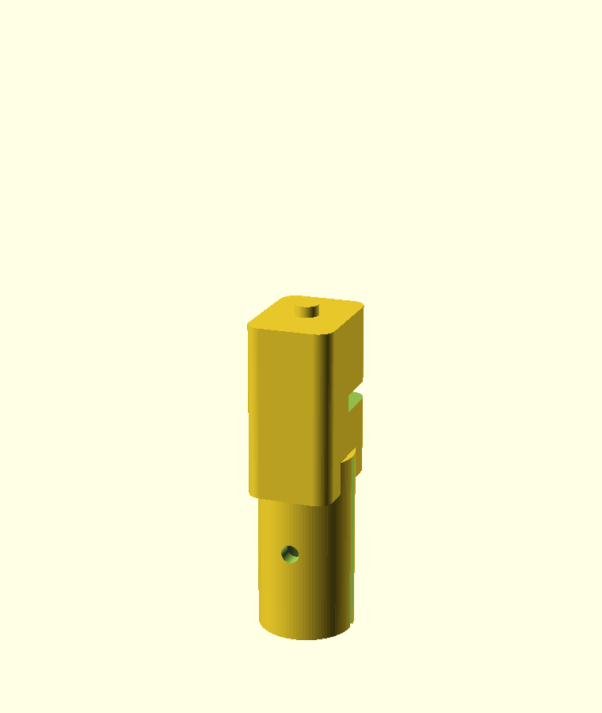

# Braccio Sketchbot — 3D-printed pen holder

A parametric, spring-loaded pen holder for the TinkerKit Braccio arm used by the
Sketchbot demo. The **stock Braccio gripper clamps this holder** — no arm
disassembly and no replacing the factory fingers. A spring-loaded piston gives
the tool ~6 mm of vertical compliance so small Z-calibration errors keep a
light, constant pressure on the paper instead of lifting the tool off or
snapping a pencil lead.

Reference (interchangeable Braccio tools / "design your own finger"):
<https://docs.arduino.cc/retired/getting-started-guides/Braccio/>

## Choose a drawing tool

Set `tool` at the top of [`pen_holder.scad`](pen_holder.scad):

| `tool`           | Barrel Ø | Notes                                                        |
| ---------------- | -------- | ------------------------------------------------------------ |
| `sharpie`        | 12.0 mm  | **Recommended.** Sharpie Fine Point — consistent barrel, globally available, won't run short like a sharpened pencil. |
| `sharpie_ultra`  | 11.0 mm  | Sharpie Ultra Fine — thinner line for detailed portraits.    |
| `pencil`         | 7.8 mm   | Standard hex pencil (measured across the corners).           |

A Sharpie is the best choice for a booth / live-gallery setup: the barrel
diameter and tip are consistent, refills are unnecessary, and you can buy the
exact same marker almost anywhere in the world.

## Parts to print

| Part     | Render command                                             | Qty |
| -------- | ---------------------------------------------------------- | --- |
| `body`   | `openscad -o body.stl   -D 'part="body"'   pen_holder.scad`   | 1   |
| `piston` | `openscad -o piston.stl -D 'part="piston"' pen_holder.scad`   | 1   |

Pre-rendered STLs (Sharpie default) are included: `pen_holder_body.stl`,
`pen_holder_piston.stl`. A one-piece no-spring fallback is
`pen_holder_rigid.stl` (`part="rigid"`).

To render a different tool, add `-D 'tool="pencil"'` (or `sharpie_ultra`) to the
command.

## Print settings

- Material: PLA or PETG.
- Layer height: 0.2 mm.
- Perimeters: 3+ (the C-clamp needs to be stiff enough to grip).
- Infill: 30–40 %.
- Supports: **none needed** — both parts print upright as oriented.
- Orientation: print `piston` clamp-down (spring shaft up); print `body` as-is.

## Hardware (BOM)

- 1 × compression spring, ~6 mm OD, ~16 mm free length — a standard
  **ballpoint-pen spring** works perfectly.
- 1 × 2.5 mm zip tie **or** 1 × M3×10 screw + nut to squeeze the clamp shut.

## Assembly

1. Drop the spring into the `body` bore (it rests against the internal ceiling;
   the small top hole is just an air vent).
2. Insert the `piston` shaft up into the `body` from the bottom, compressing the
   spring slightly, until the retention tab snaps into the side slot. The piston
   should now spring back down and be captured (it can't fall out).
3. Slide the marker/pencil into the clamp at the bottom until the tip protrudes
   the length you want.
4. Squeeze the clamp closed with the zip tie (or M3 screw) through the
   cross-hole so the tool is held firmly.
5. Hand the assembled holder to the Braccio gripper and close the gripper onto
   the flat sides of the `body`. The horizontal groove on each flat captures the
   finger tips so the holder can't slide out.

## Fitting it to the arm / software

- Close the gripper (`M6`) until it firmly holds the `body` flats. Note that
  angle and set `pen.down_gripper` in
  [`../../config/workspace.yaml`](../../config/workspace.yaml).
- Measure from the wrist axis to the tool tip **with the holder mounted** and set
  `links.wrist_pen_mm`.
- Set `pen.down_z_mm` so the spring is lightly preloaded (piston pushed up
  ~2–3 mm) when the tip touches the paper. The compliance absorbs the rest.
- Verify travel moves with `python -m sketch_artist.cli --dry-run` before letting
  the arm touch paper.

## Tuning the model

All dimensions are parameters at the top of [`pen_holder.scad`](pen_holder.scad):

| Parameter     | Meaning                                                        |
| ------------- | ------------------------------------------------------------- |
| `tool_dia`    | Auto-set from `tool`; override for an unlisted barrel.         |
| `grip_width`  | Distance between the two gripped flats — match your gripper opening. |
| `travel`      | Vertical compliance (spring stroke).                          |
| `spring_free` | Free length of your spring.                                   |
| `clamp_slot`  | Split width; increase if the clamp won't squeeze tight enough. |

Re-render after any change and confirm each part reports `Volumes: 2` (a single
solid) in the OpenSCAD console.
