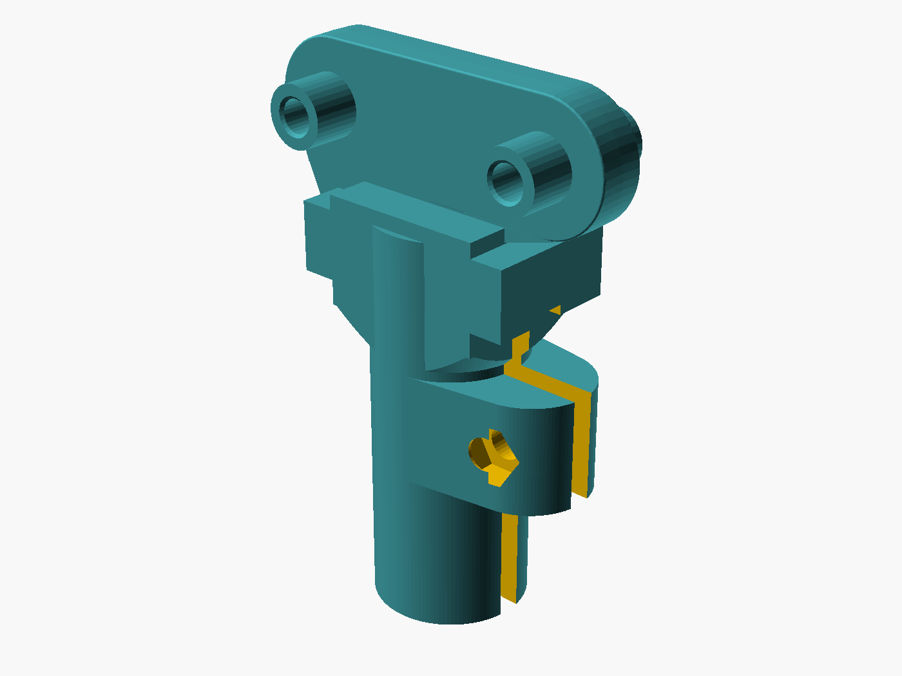

# Braccio pencil / pen drawing grip

The 3D-printed drawing tool for the Sketchbot: a **rigid split-collar
replacement finger** for the TinkerKit Braccio that holds a pencil, pen or
marker. It keeps the exact Braccio two-hole mounting interface (25 mm spacing)
and clamps the tool with an M3 screw + captive nut, so the pen stays put while
the arm moves — no reliance on gripper-servo pressure, which makes sketches
repeatable.



> **Source / attribution:** *Braccio ROS2 Pencil/Pen Drawing Grip – Arduino
> UNO Q + Edge Impulse Demo* by **eoinedge**, published on Thingiverse:
> <https://www.thingiverse.com/thing:7382987>.
> Licensed **CC BY-SA 4.0** (see [LICENSE](LICENSE)). This differs from the
> repository's MIT license, which does not cover the files in this folder.

## Files

| File                              | Purpose                                        |
| --------------------------------- | ---------------------------------------------- |
| `braccio_pencil_grip_8mm.stl`     | Print for common 7–8 mm wooden pencils.        |
| `braccio_pencil_grip_10mm.stl`    | Print for thicker pens and markers.            |
| `braccio_pencil_grip_8mm.obj`     | OBJ mesh (8 mm), for non-STL slicers/viewers.  |
| `braccio_pencil_grip_10mm.obj`    | OBJ mesh (10 mm).                              |
| `braccio_pencil_grip.scad`        | Fully parameterised OpenSCAD source.           |
| `braccio_pencil_grip_8mm.scad`    | Preset wrapper (8 mm).                          |
| `braccio_pencil_grip_10mm.scad`   | Preset wrapper (10 mm).                         |
| `braccio_mount_reference_mm.stl`  | Exact mount geometry **required** by the SCAD.  |
| `braccio_wrist_camera_bracket.stl`| Bracket for the wrist/gripper-mounted camera.  |
| `braccio_camera_mount.stl`        | End-effector ("last DOF") camera mount.        |
| `braccio_pencil_grip_preview.png` | Render preview.                                |

The two STLs are watertight and validated (see the Thingiverse package): both
~38 × 22 × 55 mm, ~15 cm³.

## Hardware

- 1 × M3 socket-head screw, 16–20 mm long
- 1 × M3 hex nut
- The original Braccio finger mounting screws

## Print settings

- Material: **PETG preferred** (best clamp flex); PLA+ also fine.
- Layer height: 0.20 mm.
- Walls: 4 · Top/bottom: 5 · Infill: 30–40 % gyroid or cubic.
- Supports: build-plate supports may be needed under the collar/shoulder.

## Assembly

1. Print the required size (mounting face on the plate, or on its side with
   supports under the collar).
2. Press the M3 nut into the captive hex pocket.
3. Fit the M3 screw loosely through the opposite clamp ear.
4. Mount the grip in place of **one** Braccio finger using the original screws.
5. Insert the pencil until **25–40 mm** protrudes below the collar.
6. Tighten the M3 screw just enough to stop slipping — don't crush a wooden
   pencil.
7. Leave the opposing Braccio finger open, or remove it if it fouls the pencil.

## OpenSCAD customization

Edit `pencil_diameter` at the top of `braccio_pencil_grip.scad` (range 6–12 mm);
the bore is `pencil_diameter + fit_clearance`. `braccio_mount_reference_mm.stl`
is already scaled to millimetres and must sit next to the SCAD file when you
render.

```bash
openscad -o my_grip.stl -D 'pencil_diameter=9' braccio_pencil_grip.scad
```

## Wiring it into the Sketchbot software

Because the pen is **rigidly clamped** (not held by the gripper), a couple of
config notes in [`../../config/workspace.yaml`](../../config/workspace.yaml):

- Measure from the wrist axis to the **pen tip with this grip mounted** and set
  `links.wrist_pen_mm` (the pencil protrudes 25–40 mm below the collar — keep it
  consistent between sketches).
- The gripper servo no longer clamps the tool, so `pen.down_gripper` just sets a
  neutral finger angle; leave the opposing finger clear of the pencil.
- There is no built-in Z compliance. Tune `pen.down_z_mm` carefully and keep
  downward force light. A spring-loaded Z-compliance stage can be added between
  the wrist and this grip later if the table isn't flat.
